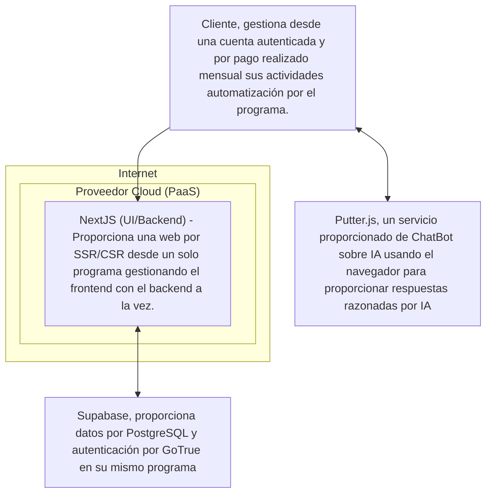

# Diagrama de Contenedor

```mermaid
flowchart TB

    Client["Cliente, gestiona desde una cuenta autenticada y por pago realizado mensual sus actividades automatización por el programa."]
    PutterJS["Putter.js, un servicio proporcionado de ChatBot sobre IA usando el navegador para proporcionar respuestas razonadas por IA"]
    Supabase["Supabase, proporciona datos por PostgreSQL y autenticación por GoTrue en su mismo programa"]

    Client <--> PutterJS
    Client --> NextJS
    NextJS <--> Supabase
    

    subgraph Internet
        subgraph CloudProvider["Proveedor Cloud (PaaS)"]
            NextJS["NextJS (UI/Backend) - Proporciona una web por SSR/CSR desde un solo programa gestionando el frontend con el backend a la vez."]
        end
    end

```