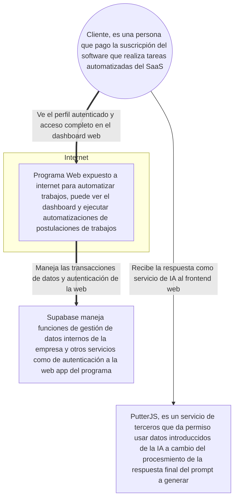

# Diagrama de Sistema sobre Contexto

```mermaid
flowchart TB

    Client(("Cliente, es una persona que pago la suscricpión del software que realiza tareas automatizadas del SaaS"))

    subgraph Internet
        SoftwareSystem["Programa Web expuesto a internet para automatizar trabajos, puede ver el dashboard y ejecutar automatizaciones de postulaciones de trabajos"]
    end
    
    BackendSupabase["Supabase maneja funciones de gestión de datos internos de la empresa y otros servicios como de autenticación a la web app del programa"]

    PutterJS["PutterJS, es un servicio de terceros que da permiso usar datos introduccidos de la IA a cambio del procesmiento de la respuesta final del prompt a generar"]


    SoftwareSystem ==>|Maneja las transacciones de datos y autenticación de la web| BackendSupabase

    Client ==>|Ve el perfil autenticado y acceso completo en el dashboard web| SoftwareSystem

        

    Client ---->|Recibe la respuesta como servicio de IA al frontend web| PutterJS

    

```